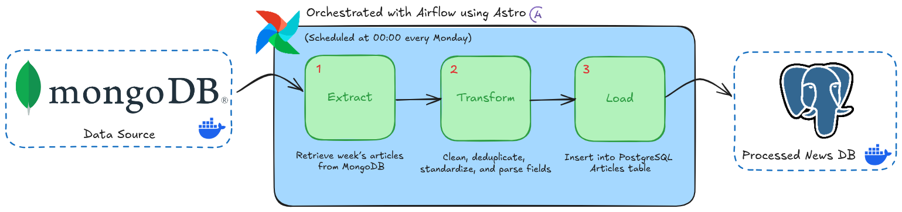

# Economics News ETL

## Description

The Economics News ETL project is designed to extract, transform, and load (ETL) news data from various economic news sources into a PostgreSQL database. The source data is stored in a MongoDB database and is extracted from my previous project, [Economics News Scraper](https://github.com/jaguzmana/economics-news-scraper). This project automates the collection, cleaning, and storage of news data, which can then be used for analysis and reporting. The pipeline is orchestrated using Astro (Astronomer), an Airflow-based platform, with DAGs defined in the `dags/` directory. The project utilizes Python and Docker for containerized deployment.

## Table of Contents

- [Description](#description)
- [How to run the project?](#how-to-run-the-project)
  - [Prerequisites](#prerequisites)
  - [Steps](#steps)
- [Astro & Docker Setup](#astro--docker-setup)
- [Airflow DAG](#airflow-dag)
- [License](#license)
- [Contact Information](#contact-information)

## Project Architecture



## How to run the project?

### Prerequisites

- **Python:** Ensure Python is installed on your machine.
- **Docker:** Make sure Docker and Docker Compose are installed on your machine.
- **Astro CLI:** Install the Astro CLI (see [Astro CLI documentation](https://docs.astronomer.io/astro/cli-install)).

### Steps

1. Clone the repository:

   ```bash
   git clone https://github.com/jaguzmana/economics-news-etl.git
   ```

2. Ensure you have a `.env` file in the `etl_docker_db/` folder with the following content:

   ```env
   POSTGRES_USER=postgres
   POSTGRES_PW=adminadmin
   POSTGRES_DB=postgres
   POSTGRES_DB_ETL=EconomicsNews
   PGADMIN_MAIL=admin@admin.com
   PGADMIN_PW=adminadmin
   ```

3. Start the database and pgAdmin using Docker Compose (see next section). The pgAdmin instance is independent from Astro and is used to manage your PostgreSQL database.

4. Start Astro locally (Astro will automatically create and manage the Python environment for you):

   ```bash
   astro dev start
   ```

5. Trigger the DAG `economics_news_etl` from the Astro UI or CLI.

6. Monitor the ETL process in the Astro UI and check logs for details.

7. After testing the pipeline, stop the Astro environment:

   ```bash
   astro dev stop
   ```

## Astro & Docker Setup

To run the PostgreSQL database and pgAdmin, follow these steps:

1. Ensure Docker and Docker Compose are installed on your machine.

2. Use the provided Docker Compose file located at `etl_docker_db/docker-compose.yml`:

   ```bash
   docker-compose -f etl_docker_db/docker-compose.yml up
   ```

3. Access pgAdmin by navigating to `http://localhost:5051` in your browser. Log in with the email and password provided in the `.env` file in `etl_docker_db/`.

4. Use the pgAdmin interface to manage your PostgreSQL database. This pgAdmin instance is separate from Astro and is only for database management.

5. Start Astro locally and trigger the ETL DAG as described above.

## Airflow DAG

The ETL pipeline is orchestrated using an Airflow DAG defined in the `dags/dag.py` file. The DAG automates the following steps:

1. **Extract**: Connects to the MongoDB database and extracts articles from the past week using a custom aggregation pipeline.
2. **Transform**: Cleans the extracted articles, removes duplicates, standardizes fields, and parses dates and newspaper names.
3. **Load**: Prepares the transformed articles for loading into the target system (e.g., PostgreSQL).

## License
This project is licensed under the MIT License - see the [LICENSE](LICENSE) file for details.

## Contact Information
For questions or support, please open an issue in the [GitHub repository](https://github.com/jaguzmana/economics-news-etl/issues).
