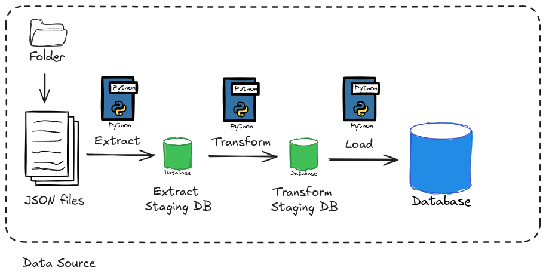

# Economics News ETL

## Description
The Economics News ETL project is designed to extract, transform, and load (ETL) news data from various economic news sources into a PostgreSQL database. The data used in this project is extracted from my previous project, [Economics News Scraper](https://github.com/jaguzmana/economics-news-scraper). This project automates the collection, cleaning, and storage of news data, which can then be used for analysis and reporting. The pipeline involves reading the scraped raw data, processing it to ensure consistency, and finally storing it in a structured format in a database. The project utilizes Python, SQLAlchemy for database interaction, and Docker for containerized deployment.

## Table of Contents
- [Description](#description)
- [How to run the project?](#how-to-run-the-project)
  - [Prerequisites](#prerequisites)
  - [Steps](#steps)
- [Docker Setup](#docker-setup)
- [License](#license)
- [Contact Information](#contact-information)

## Project Architecture


## How to run the project?

### Prerequisites
- **Python:** Ensure Python is installed on your machine and you can create a virtual environment to install the necessary modules.
- **Docker:** Make sure Docker and Docker Compose are installed on your machine.

### Steps
1. Clone the repository:
   ```bash
   git clone https://github.com/jaguzmana/economics-news-etl.git
   ```

2. Create a virtual environment:
   ```bash
   python3 -m venv venv
   ```

3. Activate the virtual environment:
   ```bash
   source venv/bin/activate
   ```

4. Install the necessary modules using the `requirements.txt` file:
   ```bash
   pip install -r requirements.txt
   ```

5. Ensure you have a `.env` file in the root of your project directory with the following content:
   ```env
   POSTGRES_USER=postgres
   POSTGRES_PW=adminadmin
   POSTGRES_DB=postgres
   POSTGRES_DB_ETL_1=EconomicsNews
   PGADMIN_MAIL=admin@admin.com
   PGADMIN_PW=adminadmin
   DATA_LOCATION=/home/jaguzmana/projects/economics-news-scraper/data
   DATA_LOCATION_STG_EXTRACTED=/home/jaguzmana/projects/economics-news-etl/scr/data/staging_extracted_data/stg_extracted.csv
   DATA_LOCATION_STG_TRANSFORMED=/home/jaguzmana/projects/economics-news-etl/scr/data/staging_transformed_data/stg_transformed.csv
   ```

6. Run the ETL process:
   ```bash
   python3 main.py
   ```

7. Check out the `app.log` file or the terminal to ensure the ETL process worked as expected.

## Docker Setup

To run the PostgreSQL database and pgAdmin using Docker, follow these steps:

1. Ensure Docker and Docker Compose are installed on your machine.

2. Create a `docker-compose.yml` file in the root of your project directory with the following content:
   ```yaml
   services:
     postgres:
       container_name: postgres
       image: postgres:latest
       environment:
         - POSTGRES_USER=${POSTGRES_USER}
         - POSTGRES_PASSWORD=${POSTGRES_PW}
         - POSTGRES_DB=${POSTGRES_DB}
       ports:
         - "5432:5432"
       volumes:
         - postgres-data:/var/lib/postgresql/data
       restart: always

     pgadmin:
       container_name: pgadmin
       image: dpage/pgadmin4:latest
       environment:
         - PGADMIN_DEFAULT_EMAIL=${PGADMIN_MAIL}
         - PGADMIN_DEFAULT_PASSWORD=${PGADMIN_PW}
       ports:
         - "5050:80"
       restart: always

   volumes:
     postgres-data:
   ```

3. Start the Docker container:
   ```bash
   docker-compose up
   ```

4. Access pgAdmin by navigating to `http://localhost:5050` in your browser. Log in with the email and password provided in the `.env` file.

5. Use the pgAdmin interface to manage your PostgreSQL database.

## License
This project is licensed under the MIT License - see the [LICENSE](LICENSE) file for details.

## Contact Information
For questions or support, please open an issue in the [GitHub repository](https://github.com/jaguzmana/economics-news-etl/issues) or reach out via [Twitter (now X)](https://x.com/jaguzmana_).
